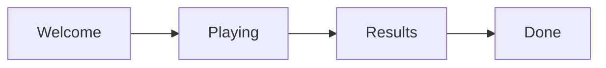

# Architectuur

## Fase-flow
[Beschrijf hier de fases van je applicatie]



## Data Flow
```
Engine (pure functies) → Store (state management) → Components (UI)
```

- **Engine**: Pure functies die input ontvangen en output retourneren
- **Store**: `game.svelte.ts` — enige bron van waarheid, Svelte 5 runes
- **Components**: UI-laag, geen eigen game-state, alleen via `getGameState()`

## Routing
- SPA (single page application)
- `+layout.svelte`: analytics init, globale UI (background, cookie banner)
- `+page.svelte`: phase router die het juiste scherm toont op basis van `game.phase`

## Analytics
- PostHog (EU endpoint, `person_profiles: 'never'`)
- Alle events via `src/lib/utils/analytics.ts` wrapper
- Try/catch — analytics mag nooit de app breken
